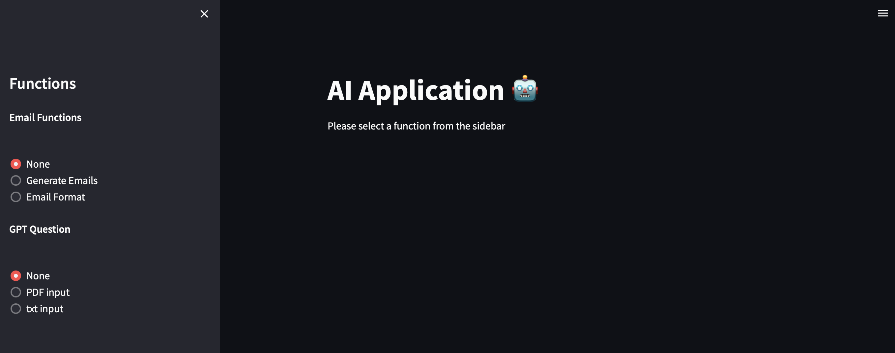
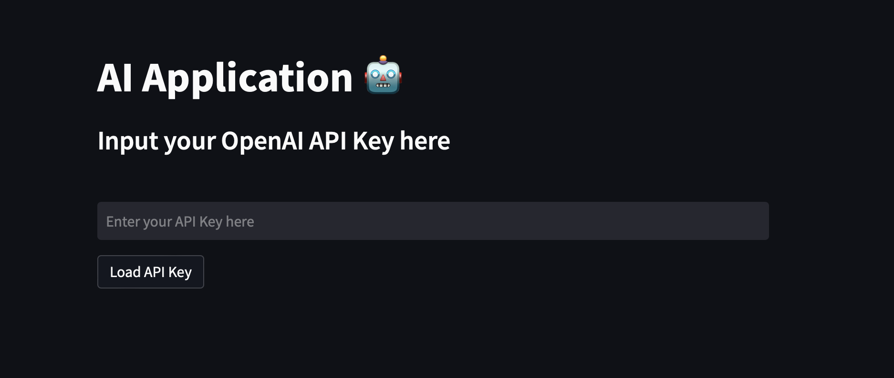

# AI Application - README
This is a Streamlit-based web application that provides several AI-powered functionalities.

project try out here https://gptfunctions.streamlit.app/

## Functions
The application provides the following functionalities:

### Email Functions

* Generate Emails: Generate a response email to an input email based on the specified tone and dialect.
* Email Format: Convert a poorly-worded email to a properly formatted email based on the specified tone and dialect.

### GPT Question

* PDF input: Generate an answer to a question asked about a PDF document uploaded by the user.
* txt input: Generate an answer to a question asked about a text document entered by the user.

## Installation
This project is built using Python and requires the following packages to be installed:

* Streamlit
* langchain
* openai
* pinecone

After installing the dependencies, you can run the app using the following command:
> streamlit run main.py

## Usage
After running the command, the application will open in your web browser. You will need to input your OpenAI API Key to use the application. The app has two main functions, which are accessed through the sidebar. You can either use the Email Functions or the GPT Question functions.

### Email Functions
The Email Functions consist of two sub-functions, Generate Emails and Email Format.

* Generate Emails: To generate an email response, select the tone and dialect you want to use from the dropdown menus, and then enter the email to which you want to respond in the text box. After you click the Generate Response Email button, the app will generate the response based on your inputs.

* Email Format: To format a poorly-worded email, select the tone and dialect you want to use from the dropdown menus, and then enter the email you want to format in the text box. After you click the Generate Convert Email button, the app will format the email based on your inputs.

### GPT Question
The GPT Question function allows you to ask questions and receive answers based on either a PDF document or a text document.

* PDF input: To generate an answer to a question about a PDF document, upload the PDF document and enter your question in the text box. After you click the Submit question button, the app will generate an answer based on your inputs.

* txt input: To generate an answer to a question about a text document, enter the text document in the text box and enter your question in the text box. After you click the Submit question button, the app will generate an answer based on your inputs.

## Deployment
This app is deployed using Streamlit Sharing, which allows you to deploy your app on the web with a single click. The deployed app can be accessed at the following URL:

https://gptfunctions.streamlit.app/

Conclusion
This application provides a variety of AI-powered functionalities that can be used to generate emails and answers to questions. The application is easy to use and can be used by anyone with a basic understanding of how to use a web browser.